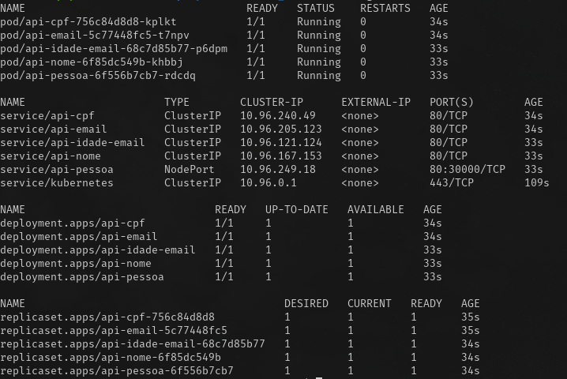

# Estudos K8S

## O projeto

Uma API simples que recebe uma requisição e retorna o cadastro de uma pessoa contendo alguns campos. O cadastro também é salvo no banco de dados. Esses campos são obtidos em outras APIs.

Exemplo de Response:

```json
{
    "Id": 7,
    "Nome": "Davi Barros",
    "CPF": "732.480.22-520",
    "Idade": 47,
    "Email": "email_19@hotmail.com"
}
```


## Tecnologias utilizadas

 - Docker e Docker Compose
 - [kind](https://kind.sigs.k8s.io/) para execução do cluster kubernetes localmente
 - [kubectl](https://kind.sigs.k8s.io/) para execução dos comandos no cluster kubernetes
 - Golang para alteração do código (não obrigatório)


## Banco de dados

Propositalmente o banco de dados MySQL está sendo executado fora do cluster kubernetes.


## Primeira coisa a se fazer

Será necessário ter o registry local criado para armazenar as imagens. E esse procedimento é realizado quando o cluster no `kind` é criado. Vá até [inicializar o cluster](#inicializar-o-cluster) para poder também criar o registry local e logo em seguida retorne para os próximos passos.


## Docker

### Inicializar o banco de dados

```
docker-compose -f ./docker/docker-compose.yaml up -d
```

### Buildar as imagens das APIs

```
docker build -t framosip/api-k8s-cpf:v1 -t framosip/api-k8s-cpf:latest -f ./apis/Dockerfile ./apis/cpf
```

```
docker build -t framosip/api-k8s-email:v1 -t framosip/api-k8s-email:latest -f ./apis/Dockerfile ./apis/email
```

```
docker build -t framosip/api-k8s-idade-email:v1 -t framosip/api-k8s-idade-email:latest -f ./apis/Dockerfile ./apis/idade-email
```

```    
docker build -t framosip/api-k8s-nome:v1 -t framosip/api-k8s-nome:latest -f ./apis/Dockerfile ./apis/nome
```

```    
docker build -t framosip/api-k8s-pessoa:v1 -t framosip/api-k8s-pessoa:latest -f ./apis/Dockerfile ./apis/pessoa
```

### Tagear a imagens para o registry local
```
docker tag framosip/api-k8s-cpf:latest localhost:5001/api-k8s-cpf:latest
```

```
docker tag framosip/api-k8s-email:latest localhost:5001/api-k8s-email:latest
```

```
docker tag framosip/api-k8s-idade-email:latest localhost:5001/api-k8s-idade-email:latest
```

```
docker tag framosip/api-k8s-nome:latest localhost:5001/api-k8s-nome:latest
```

```
docker tag framosip/api-k8s-pessoa:latest localhost:5001/api-k8s-pessoa:latest
```

### Publicar as imagens no registry local

```
docker push localhost:5001/api-k8s-cpf:latest
```

```
docker push localhost:5001/api-k8s-email:latest
```

```
docker push localhost:5001/api-k8s-idade-email:latest
```

```
docker push localhost:5001/api-k8s-nome:latest
```

```
docker push localhost:5001/api-k8s-pessoa:latest
```

## Kubernetes

Rodando um cluster local utilizando o Kind com um control-plane e um worker, além do registry local.

### Inicializar o cluster

Executar o script localizado em `./other/kind-registry.sh`

Caso esteja aqui apenas inicializando o cluster para ter o registry local criado, retorne a [etapa de criação das imagens.](#primeira-coisa-a-se-fazer)

### Manifestos

Os manifestos estão localizados em `./k8s`


### Deployment

Cada API possui um manifesto de deployment.

```yaml
apiVersion: apps/v1
kind: Deployment
metadata:
    name: api-cpf
...
```

```yaml
apiVersion: apps/v1
kind: Deployment
metadata:
    name: api-email
...
```

```yaml
apiVersion: apps/v1
kind: Deployment
metadata:
    name: api-idade-email
...
```

```yaml
apiVersion: apps/v1
kind: Deployment
metadata:
    name: api-nome
...
```

```yaml
apiVersion: apps/v1
kind: Deployment
metadata:
    name: api-pessoa
...
```

### Image Pull

Os deployments estão configurados para sempre baixarem as imagens. Como está sendo utilizada a versão latest , sempre que manifestos são aplicados a imagem é novamente baixada.

```yaml
apiVersion: apps/v1
kind: Deployment
...
    spec:
      containers:
...
        imagePullPolicy: Always
...   
```

### LivenessProbe

Os PODs estão configurados para checar se estão disponívels através de uma chamada HTTP GET no endpoint `/health` . Utilizando a porta `8080` que está exposta no container. A checagem é realizada a cada `5` segundos (aguardando por até `5` segundos de timout) por até `10` vezes podendo atingir o `failureThreshold`. Quando isso acontece o POD é reiniciado. Logo, em média, nessas configurações, o POD pode ser reiniciado em `50`segundos (`5 * 10`) .

```yaml
apiVersion: apps/v1
kind: Deployment
...
    spec:
      containers:
...
        livenessProbe:
          httpGet:
            path: /health
            port: 8080
            scheme: HTTP
          periodSeconds: 5
          timeoutSeconds: 5
          failureThreshold: 10        
```


### Service

As APIs de `cpf`, `email`, `idade-email` e `nome` possuem services do tipo `ClusterIP` por estarem acessíveis apenas dentro do cluster. Já que a API `nome` é a única que realiza chamadas a estas APIs. E a comunicação é utilizando a porta `80`.

```yaml
apiVersion: v1
kind: Service
metadata:
  name: api-cpf
...
```

```golang
...
//Obter um CPF
responseCPF, err := http.Get("http://api-cpf/new")
...
```

```yaml
apiVersion: v1
kind: Service
metadata:
  name: api-email
...
```

```golang
...
//Obter um E-mail
responseEmail, err := http.Get("http://api-email/new")
...
```

```yaml
apiVersion: v1
kind: Service
metadata:
  name: api-idade-email
...
```

```golang
...
//Obter uma Idade e E-mail
responseIdadeEmail, err := http.Get("http://api-idade-email/new")
...
```

```yaml
apiVersion: v1
kind: Service
metadata:
  name: api-nome
...
```

```golang
...
//Obter um nome
responseNome, err := http.Get("http://api-nome/new")
...
```

---

A API `pessoa` possui um serviço do tipo `NodePort` na porta `30000`. Esta porta já está mapeada no momento da inicialização do cluster no `Kind`.


```yaml
apiVersion: v1
kind: Service
metadata:
  name: api-pessoa
...
  ports:
...
    nodePort: 30000
  type: NodePort

```

### ConfigMap

As configurações de acesso ao banco de dados (exceto usuário e senha) estão registradas no `mysql-configmap.yaml`

```yaml
apiVersion: v1
kind: ConfigMap
metadata:
  name: mysql
...
```

E referenciadas no deployment da API `pessoa` que repassa essas configurações para o código.

```yaml
apiVersion: apps/v1
kind: Deployment
metadata:
  name: api-pessoa
...
        envFrom:
          - configMapRef:
              name: mysql
...

```

##### **MUITO IMPORTANTE**

É necessário informar o ip do host Docker neste configmap. Ou seja, o ip do computador que está executando o Docker e o cluster kubernetes.

```yaml
...
data:
  MYSQL_SERVER: <<IP_AQUI>>
...
```

### Secret

As configurações de acesso ao banco de dados (usuário e senha) estão registradas no `mysql-secret.yaml`

**Não é necessário alterar nada por que já está de acordo com as informações fornecidas no docker-compose utilizado para inicializar o banco de dados**

```yaml
apiVersion: v1
kind: Secret
metadata:
  name: mysql
...

```

E referenciadas no deployment da API `pessoa` que repassa essas configurações para o código.

```yaml
apiVersion: apps/v1
kind: Deployment
metadata:
  name: api-pessoa
...
        envFrom:
...
          - secretRef:
              name: mysql
...
```

## Aplicando os manifestos

**IMPORTANTE**
Não esqueça de configurar o ip do host Docker referente ao MySQL.
[Veja aqui como configurar](#muito-importante)


```
kubectl apply -f ./k8s
```

### Validando

Ao executar 
```
kubectl get all
```

poderá ser visto algo parecido com:




## Testando

```
curl --location --request POST 'http://localhost:30000/pessoa'
```

