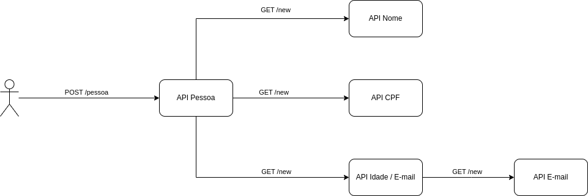

# Estudos K8S

 - [O projeto](#o-projeto)
 - [Tecnologias utilizadas](#tecnologias-utilizadas)
 - [Banco de Dados](#banco-de-dados)
 - [Primeira coisa a se fazer](#primeira-coisa-a-se-fazer)
 - [Docker](#docker)
 - [Kubernetes](#kubernetes)
    - [Inicializar o cluster](#inicializar-o-cluster)
    - [Manifestos](#manifestos)
    - [Deployment](#deployment)
      - [Image Pull](#image-pull)
      - [LivenessProbe](#livenessprobe)
      - [ReadinessProbe](#readinessprobe)
      - [StartupProbe](#startupprobe)
      - [Resources](#resources)
        - [Requests](#requests)
        - [Limits](#limits)
        - [Visualizando consumo de memória e CPU](#visualizando-consumo-de-memória-e-cpu)
        - [Erros com o Metrics Server](#erros-com-o-metrics-server)
    - [Service](#service)
    - [ConfigMap](#configmap)
      - [Muito Importante](#muito-importante)
    - [Secret](#secret)
 - [Aplicando os manifestos](#aplicando-os-manifestos)
    - [Validando](#validando)
 - [Testando](#testando)    

---

## O projeto

Uma API simples que recebe uma requisição e retorna o cadastro de uma pessoa contendo alguns campos. O cadastro também é salvo no banco de dados. Esses campos são obtidos em outras APIs.

Exemplo de Response:

```json
{
    "Id": 7,
    "Nome": "Davi Barros",
    "CPF": "732.480.22-520",
    "Idade": 47,
    "Email": "email_19@hotmail.com"
}
```



[Voltar para o topo](#estudos-k8s)


## Tecnologias utilizadas

 - Docker e Docker Compose
 - [kind](https://kind.sigs.k8s.io/) para execução do cluster kubernetes localmente
 - [kubectl](https://kind.sigs.k8s.io/) para execução dos comandos no cluster kubernetes
 - Golang para alteração do código (não obrigatório)

[Voltar para o topo](#estudos-k8s)


## Banco de dados

Propositalmente o banco de dados MySQL está sendo executado fora do cluster kubernetes.

[Voltar para o topo](#estudos-k8s)


## Primeira coisa a se fazer

Será necessário ter o registry local criado para armazenar as imagens. E esse procedimento é realizado quando o cluster no `kind` é criado. Vá até [inicializar o cluster](#inicializar-o-cluster) para poder também criar o registry local e logo em seguida retorne para os próximos passos.

[Voltar para o topo](#estudos-k8s)

## Docker

### Inicializar o banco de dados

```
docker-compose -f ./docker/docker-compose.yaml up -d
```

### Buildar as imagens das APIs

```
docker build -t framosip/api-k8s-cpf:v1 -t framosip/api-k8s-cpf:latest -f ./apis/Dockerfile ./apis/cpf
```

```
docker build -t framosip/api-k8s-email:v1 -t framosip/api-k8s-email:latest -f ./apis/Dockerfile ./apis/email
```

```
docker build -t framosip/api-k8s-idade-email:v1 -t framosip/api-k8s-idade-email:latest -f ./apis/Dockerfile ./apis/idade-email
```

```    
docker build -t framosip/api-k8s-nome:v1 -t framosip/api-k8s-nome:latest -f ./apis/Dockerfile ./apis/nome
```

```    
docker build -t framosip/api-k8s-pessoa:v1 -t framosip/api-k8s-pessoa:latest -f ./apis/Dockerfile ./apis/pessoa
```

### Tagear a imagens para o registry local
```
docker tag framosip/api-k8s-cpf:latest localhost:5001/api-k8s-cpf:latest
```

```
docker tag framosip/api-k8s-email:latest localhost:5001/api-k8s-email:latest
```

```
docker tag framosip/api-k8s-idade-email:latest localhost:5001/api-k8s-idade-email:latest
```

```
docker tag framosip/api-k8s-nome:latest localhost:5001/api-k8s-nome:latest
```

```
docker tag framosip/api-k8s-pessoa:latest localhost:5001/api-k8s-pessoa:latest
```

### Publicar as imagens no registry local

```
docker push localhost:5001/api-k8s-cpf:latest
```

```
docker push localhost:5001/api-k8s-email:latest
```

```
docker push localhost:5001/api-k8s-idade-email:latest
```

```
docker push localhost:5001/api-k8s-nome:latest
```

```
docker push localhost:5001/api-k8s-pessoa:latest
```

[Voltar para o topo](#estudos-k8s)

## Kubernetes

Rodando um cluster local utilizando o Kind com um control-plane e um worker, além do registry local.

[Voltar para o topo](#estudos-k8s)

### Inicializar o cluster

Executar o script localizado em `./other/kind-registry.sh`

Caso esteja aqui apenas inicializando o cluster para ter o registry local criado, retorne a [etapa de criação das imagens.](#primeira-coisa-a-se-fazer)

[Voltar para o topo](#estudos-k8s)

### Manifestos

Os manifestos estão localizados em `./k8s`

[Voltar para o topo](#estudos-k8s)


### Deployment

Cada API possui um manifesto de deployment.

```yaml
apiVersion: apps/v1
kind: Deployment
metadata:
    name: api-cpf
...
```

```yaml
apiVersion: apps/v1
kind: Deployment
metadata:
    name: api-email
...
```

```yaml
apiVersion: apps/v1
kind: Deployment
metadata:
    name: api-idade-email
...
```

```yaml
apiVersion: apps/v1
kind: Deployment
metadata:
    name: api-nome
...
```

```yaml
apiVersion: apps/v1
kind: Deployment
metadata:
    name: api-pessoa
...
```

[Voltar para o topo](#estudos-k8s)

#### Image Pull

Os deployments estão configurados para sempre baixarem as imagens. Como está sendo utilizada a versão latest , sempre que manifestos são aplicados a imagem é novamente baixada.

```yaml
apiVersion: apps/v1
kind: Deployment
...
    spec:
      containers:
...
        imagePullPolicy: Always
...   
```

[Voltar para o topo](#estudos-k8s)

#### LivenessProbe

Os PODs estão configurados para checar se a aplicação esta disponível através de uma chamada HTTP GET no endpoint `/health` . Utilizando a porta `8080` que está exposta no container. A checagem é realizada a cada `5` segundos (aguardando por até `5` segundos de timeout) por até `10` vezes podendo atingir o `failureThreshold`. Quando isso acontece o POD é reiniciado. Logo, em média, nessas configurações, o POD pode ser reiniciado em `50`segundos (`5 * 10`) .

Um POD com uma aplicação não saudável irá reiniciar.

```yaml
apiVersion: apps/v1
kind: Deployment
...
    spec:
      containers:
...
        livenessProbe:
          httpGet:
            path: /health
            port: 8080
            scheme: HTTP
          periodSeconds: 5
          timeoutSeconds: 5
          failureThreshold: 10        
```

[Voltar para o topo](#estudos-k8s)

#### readinessProbe

Os PODs estão configurados para checar se a aplicação esta pronta através de uma chamada HTTP GET no endpoint `/ready` . Utilizando a porta `8080` que está exposta no container. A checagem é realizada a cada `5` segundos (aguardando por até `5` segundos de timeout) por até `10` vezes podendo atingir o `failureThreshold`. Foi inserida aqui a propriedade `successThreshold` que, neste exemplo, tornará o POD com a aplicação pronta quando a configuração retornar sucesso por `3` vezes.

Um POD que possui a aplicação não pronta não reiniciará. Ficará checando se está pronta, até que esteja.

```yaml
apiVersion: apps/v1
kind: Deployment
...
    spec:
      containers:
...
        readinessProbe:
          httpGet:
            path: /ready
            port: 8080
            scheme: HTTP
          periodSeconds: 5
          timeoutSeconds: 5
          failureThreshold: 10
          successThreshold: 3
...
       
```

PODs não prontos não terão seus IPs listados como endpoints, ou seja, não receberão requisições até que estejam prontos.

É possível ver a lista de endpoints com o comando

```
kubectl get endpoints
```

Aqui um exemplo onde os deployments possuem apenas uma réplica e esta não está pronta (0/1):


Agora, quando os PODs estão prontos e seus endpoints configurados


[Voltar para o topo](#estudos-k8s)

#### startupProbe

Os PODs estão configurados para checar se a aplicação foi iniciada através de uma chamada HTTP GET no endpoint `/health` . Utilizando a porta `8080` que está exposta no container. A checagem é realizada a cada `5` segundos (aguardando por até `5` segundos de timeout) por até `20` vezes podendo atingir o `failureThreshold`. Quando isso acontece o POD é reiniciado. Logo, em média, nessas configurações, o POD pode ser reiniciado em `100`segundos (`5 * 20`) caso não a aplicação não seja iniciada.

Um POD que tem a aplicação não iniciada irá reiniciar.

Foi utilizado o mesmo endpoint de health por que o objetivo é a aplicação responder 200. Não importa qual endpoint. o 200 indica que a aplicação iniciou.


```yaml
apiVersion: apps/v1
kind: Deployment
...
    spec:
      containers:
 ...
        startupProbe:
          httpGet:
            path: /health
            port: 8080
            scheme: HTTP
          periodSeconds: 5
          timeoutSeconds: 5
          failureThreshold: 20          
...       
```

[Voltar para o topo](#estudos-k8s)

#### Resources

São configurados os recursos iniciais (`requests`) e máximos (`limits`) de memória e cpu.

[Voltar para o topo](#estudos-k8s)

##### requests

O Kubernetes procurará um `node` que possa garantir os recursos iniciais necessários para executar a aplicação dentro do POD. Ou seja, `32Mi (mebibytes)` de memória e `100m (milicores)` de CPU.

**IMPORTANTE**: A aplicação será alocada em um `node` que garanta essas configurações mínimas. Mas não necessariamente a aplicação iniciará com essas configurações. Pode, inclusive, iniciar com menos.

**IMPORTANTE**: As configurações de recurso são para o container e não para o POD. Então, por exemplo, caso existam 2 containers com a mesma configuração, o total de recursos iniciais do POD seria 64Mi de memória e 200m de CPU.

```yaml
apiVersion: apps/v1
kind: Deployment
...
    spec:
      containers:
...
        resources:
          requests:
            memory: "32Mi"
            cpu: "100m"
...       
```
[Voltar para o topo](#estudos-k8s)

##### limits

Protege o cluster Kubernetes limitando o container do POD a um limite de consumo de memória e CPU.

O container atingirá o máximo de `128Mi (mebibytes)` de memória e `500m (milicores)` de CPU. Podendo apresentar erro de `OutOfMemory` e reiniciar caso atinja ou supere os limites.

```yaml
apiVersion: apps/v1
kind: Deployment
...
    spec:
      containers:
...
        resources:
...
          limits:
            memory: "128Mi"
            cpu: "500m"        
...
```

[Voltar para o topo](#estudos-k8s)

##### Visualizando consumo de memória e CPU

É possível verificar o consumo de memória e CPU de um POD através do `Metrics Server`. Para instalar e configurar consulte o link https://github.com/kubernetes-sigs/metrics-server. 

Para visualizar o consumo de memória e CPU dos PODs

```
kubectl top pods
```


Para visualizar o consumo de memória e CPU de um POD específico 

```
kubectl top pod <<nome_do_pod>>
```

Para visualizar o consumo de memória e CPU por container

```
kubectl top pods --containers
```


Ainda é possível visualizar o consumo de memória e CPU dos nodes

```
kubectl top nodes
```


[Voltar para o topo](#estudos-k8s)


##### Erros com o Metrics Server

Alguns erros podem ser encontrados ao utilizar o Metrics Server. Basta editar o arquivo de configurações.

Editar o arquivo utilizando o editor `nano`

```
KUBE_EDITOR='nano' kubectl edit deployments.apps -n kube-system metrics-server
```

Adicionar `hostNetwork: true` logo após `dnsPolicy: ClusterFirst`

```
...
      dnsPolicy: ClusterFirst
      hostNetwork: true
...
```

Adicionar as linhas:

```
- --kubelet-insecure-tls=true
- --kubelet-preferred-address-types=InternalIP
```

logo após 

```
    spec:
      containers:
      - args:
        - --cert-dir=/tmp
        - --secure-port=4443
```

Ficando:

```
...
    spec:
      containers:
      - args:
        - --cert-dir=/tmp
        - --secure-port=4443
        - --kubelet-insecure-tls=true
        - --kubelet-preferred-address-types=InternalIP
        - --kubelet-use-node-status-port
        - --metric-resolution=15s
...
```

[Voltar para o topo](#estudos-k8s)

### Service

As APIs de `cpf`, `email`, `idade-email` e `nome` possuem services do tipo `ClusterIP` por estarem acessíveis apenas dentro do cluster. Já que a API `nome` é a única que realiza chamadas a estas APIs. E a comunicação é utilizando a porta `80`.

```yaml
apiVersion: v1
kind: Service
metadata:
  name: api-cpf
...
```

```golang
...
//Obter um CPF
responseCPF, err := http.Get("http://api-cpf/new")
...
```

```yaml
apiVersion: v1
kind: Service
metadata:
  name: api-email
...
```

```golang
...
//Obter um E-mail
responseEmail, err := http.Get("http://api-email/new")
...
```

```yaml
apiVersion: v1
kind: Service
metadata:
  name: api-idade-email
...
```

```golang
...
//Obter uma Idade e E-mail
responseIdadeEmail, err := http.Get("http://api-idade-email/new")
...
```

```yaml
apiVersion: v1
kind: Service
metadata:
  name: api-nome
...
```

```golang
...
//Obter um nome
responseNome, err := http.Get("http://api-nome/new")
...
```

---

A API `pessoa` possui um serviço do tipo `NodePort` na porta `30000`. Esta porta já está mapeada no momento da inicialização do cluster no `Kind`.


```yaml
apiVersion: v1
kind: Service
metadata:
  name: api-pessoa
...
  ports:
...
    nodePort: 30000
  type: NodePort

```

[Voltar para o topo](#estudos-k8s)

### ConfigMap

As configurações de acesso ao banco de dados (exceto usuário e senha) estão registradas no `mysql-configmap.yaml`

```yaml
apiVersion: v1
kind: ConfigMap
metadata:
  name: mysql
...
```

E referenciadas no deployment da API `pessoa` que repassa essas configurações para o código.

```yaml
apiVersion: apps/v1
kind: Deployment
metadata:
  name: api-pessoa
...
        envFrom:
          - configMapRef:
              name: mysql
...

```

[Voltar para o topo](#estudos-k8s)

##### **MUITO IMPORTANTE**

É necessário informar o ip do host Docker neste configmap. Ou seja, o ip do computador que está executando o Docker e o cluster kubernetes.

```yaml
...
data:
  MYSQL_SERVER: <<IP_AQUI>>
...
```

[Voltar para o topo](#estudos-k8s)

### Secret

As configurações de acesso ao banco de dados (usuário e senha) estão registradas no `mysql-secret.yaml`

**Não é necessário alterar nada por que já está de acordo com as informações fornecidas no docker-compose utilizado para inicializar o banco de dados**

```yaml
apiVersion: v1
kind: Secret
metadata:
  name: mysql
...

```

E referenciadas no deployment da API `pessoa` que repassa essas configurações para o código.

```yaml
apiVersion: apps/v1
kind: Deployment
metadata:
  name: api-pessoa
...
        envFrom:
...
          - secretRef:
              name: mysql
...
```

[Voltar para o topo](#estudos-k8s)

## Aplicando os manifestos

**IMPORTANTE**
Não esqueça de configurar o ip do host Docker referente ao MySQL.
[Veja aqui como configurar](#muito-importante)


```
kubectl apply -f ./k8s
```

[Voltar para o topo](#estudos-k8s)

### Validando

Ao executar 
```
kubectl get all
```

poderá ser visto algo parecido com:


[Voltar para o topo](#estudos-k8s)

## Testando

```
curl --location --request POST 'http://localhost:30000/pessoa'
```

[Voltar para o topo](#estudos-k8s)